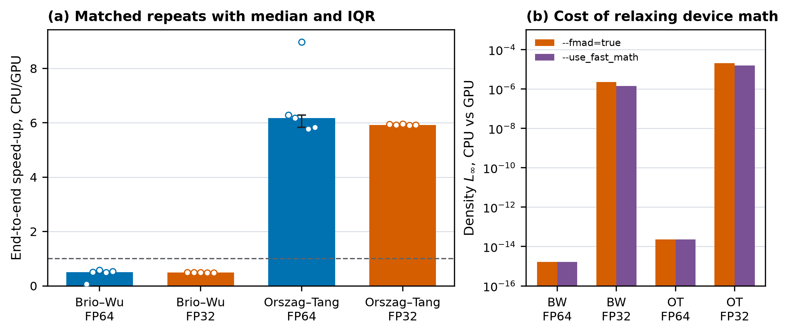

# floatpoint — a numerical qualification harness

Which build and execution conditions preserve bit-for-bit output, which change it, and
what does control cost?

## Three measured results

- With `--fmad=false`, all 4 measured CPU/GPU pairs are bit-identical
  (`ulp_max = 0`).
- With `--fmad=true`, the fp32 density L-infinity value is `2.074e-05` for
  Orszag--Tang and `2.265e-06` for Brio--Wu.
- The Euler OpenMP rows at 1, 2, 4, and 8 threads are bit-identical; the fp64
  8-thread row reaches `4.79x` over one thread.

## Two workload families, one method

Family one is a CPU/CUDA compressible-Euler and ideal-MHD solver. Family two is LLM
inference with PyTorch and vLLM. The same harness, run-record schema, and failure
taxonomy apply to both, so the determinism question is measured on a solver and a
Transformer. The solver shows that the harness accepts a non-ML workload; LLM inference
extends the method to a Transformer.

## Scope

Distributed coverage stops at intra-node two-GPU tensor parallelism and multi-node CPU
MPI. No multi-node GPU, no RDMA or InfiniBand, no scaling curves, and no distributed
training framework.

## Where to go next

- [docs/INDEX.md](docs/INDEX.md) — architecture, resources, evidence
- [docs/HARNESS.md](docs/HARNESS.md) — pipeline and run contract
- [docs/aiinfra/PLAN.md](docs/aiinfra/PLAN.md) — Family two execution plan
