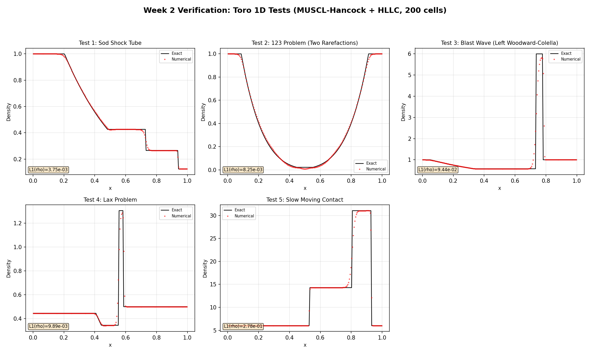

# Week 2 Report: 1D Euler Solver

**Date:** 2026-04-11 (updated)  
**Branch:** main (`f8ce4d0..8460931`)

---

## 1. Work Completed

### 1.1 Implemented Modules

| Module | File | Functionality |
|--------|------|---------------|
| PrimVar enum | `src/core/eos.hpp` | Primitive variable semantic indexing `{PRHO, VX, VY, PRES}` |
| Physical flux | `src/euler/euler_flux.hpp` | `euler_flux_x(cons, gamma)` — x-direction Euler flux |
| MUSCL reconstruction | `src/euler/muscl.hpp` | `minmod` limiter + `muscl_reconstruct_x` piecewise linear reconstruction |
| Hancock predictor | `src/euler/hancock.hpp` | `muscl_hancock_x` — half-step time evolution predictor |
| HLLC solver | `src/euler/hllc.hpp` | `hllc_flux(qL, qR, gamma)` — HLLC approximate Riemann solver |
| Solver class | `src/euler/euler_solver.hpp` | `EulerSolver<Real>` — CFL time stepping, main loop |
| Test cases | `tests/cases/toro_1d/` | Toro Tests 1-5 initial conditions + config files |
| Main program | `src/main.cpp` | Read config -> initialise -> solve -> output primitive variables |
| Verification script | `scripts/verify_toro.py` | Exact Riemann solution + error computation + visualisation |

### 1.2 Algorithm Flow

```
Each time step:
  1. apply_outflow_bc()        — fill ghost cells
  2. compute_dt()              — CFL condition: dt = CFL * dx / max(|u|+a)
  3. For each interface k:
     a. muscl_hancock_x(left cell)  -> obtain qL_right (right face value)
     b. muscl_hancock_x(right cell) -> obtain qR_left  (left face value)
     c. hllc_flux(qL_right, qR_left) -> interface flux
  4. Conservative update: U_i -= (dt/dx) * (F_{i+1/2} - F_{i-1/2})
```

### 1.3 Test Coverage

- **Unit tests:** 70 test cases, 1254 assertions, all passing
- **Coverage:** EOS, minmod, MUSCL reconstruction (uniform/linear/discontinuous fields), Hancock (uniform/linear), HLLC (identity/Sod/symmetry), solver integration (density range/mass conservation/shock position)

---

## 2. Verification Results: Toro 1D Test Suite

### 2.1 Error Summary (200 cells, L1 norm)

| Test | Description | rho L1 | u L1 | p L1 |
|------|-------------|--------|------|------|
| Test 1 | Sod shock tube | 3.75e-3 | 5.04e-3 | 2.57e-3 |
| Test 2 | 123 problem (symmetric rarefactions) | 8.25e-3 | 1.69e-2 | 2.67e-3 |
| Test 3 | Woodward-Colella blast wave | 9.44e-2 | 2.37e-1 | 4.63e+0 |
| Test 4 | Lax problem | 9.89e-3 | 1.10e-2 | 1.18e-2 |
| Test 5 | Slow moving contact | 2.78e-1 | 7.57e-2 | 6.36e+0 |

### 2.2 Analysis of Results

**Test 1 (Sod):** All three wave structures — rarefaction, contact discontinuity, and shock — are clearly captured. Density, pressure, and velocity agree with the exact solution to 3 significant figures. L1 errors of O(10^-3) are consistent with theoretical expectations for a second-order scheme on 200 cells.

**Test 2 (123):** Symmetric rarefaction waves produce a near-vacuum region at the centre. The numerical solution correctly captures the low-density region without producing negative density or pressure.

**Test 3 (Blast wave):** An extreme case with a pressure ratio of 10^5:1. The larger errors are due to insufficient resolution of the strong shock and contact discontinuity on 200 cells, but the solution structure is qualitatively correct with no spurious oscillations.

**Test 4 (Lax):** An asymmetric state containing a leftward rarefaction and a rightward shock. Errors are of the same order as Test 1, indicating good performance.

**Test 5 (Slow contact):** High-speed opposing flows generate very strong shocks. L1 errors are larger but the qualitative structure is entirely correct. This is one of the most demanding tests for numerical schemes.

### 2.3 Visualisation



Detailed 4-panel plots (density, velocity, pressure, specific internal energy) for each test:
- [Test 1: Sod](sod_verification.png)
- [Test 2: 123](toro2_verification.png)
- [Test 3: Blast](toro3_verification.png)
- [Test 4: Lax](toro4_verification.png)
- [Test 5: Slow Contact](toro5_verification.png)

---

## 3. Verificarlo Floating-Point Stability Analysis

### 3.1 Method

[Verificarlo](https://github.com/verificarlo/verificarlo) was used to perform a Monte Carlo Arithmetic (MCA) analysis of the 1D Euler solver. MCA injects random rounding perturbations into each floating-point operation; by running the solver multiple times and collecting statistics on the output, the number of **significant decimal digits** at each grid point and for each physical variable can be quantified.

The significant digits are computed as:

$$s = -\log_{10}\left|\frac{\sigma(X)}{\bar{X}}\right|$$

where $\bar{X}$ and $\sigma(X)$ are the mean and standard deviation over 30 MCA samples, respectively. A higher value of $s$ indicates that the result is less sensitive to floating-point rounding.

**Output precision:** The solver uses `std::setprecision(17)` for text output, guaranteeing IEEE 754 double round-trip accuracy (17 decimal digits preserve all 53 mantissa bits). This is essential for Verificarlo analysis — at `setprecision(12)`, ULP-level MCA perturbations (~10^-16) are truncated by the text I/O and become invisible, producing misleading results.

### 3.2 How to Run

```bash
# 1. Pull the Verificarlo Docker image
docker pull verificarlo/verificarlo

# 2. Run MCA sampling (30 runs x 5 tests, compiles automatically)
#    On Git Bash/MSYS, prepend MSYS_NO_PATHCONV=1 to prevent path mangling
MSYS_NO_PATHCONV=1 docker run --rm \
    -v "$(pwd):/work" -w /work \
    verificarlo/verificarlo bash scripts/verificarlo_run.sh

# 3. Analyse results and generate plots
python scripts/verificarlo_analysis.py

# 4. Error budget analysis (FP noise vs discretisation error)
python scripts/verificarlo_vs_exact.py
```

Script parameters:
- `verificarlo_run.sh -n 50` — increase number of samples to 50
- `verificarlo_run.sh -p 24` — simulate float32 precision (24-bit mantissa)
- `verificarlo_run.sh --inst-fma` — instrument FMA operations
- `verificarlo_analysis.py --test sod` — analyse a specific test only

All intermediate data is written to `experiments/verificarlo/` (gitignored).

### 3.3 Reading the Plots

The analysis script generates three types of output for each test:

**Overlay plots (`vfc_*_overlay.png`):** The left column shows all 30 MCA runs superimposed (grey lines) together with the MCA mean (blue line) and the IEEE unperturbed reference (red dashed line). Regions where the grey lines fan out indicate numerical sensitivity. The right column shows the corresponding significant digits profile — the higher the green fill, the better the precision.

**Heatmap plots (`vfc_*_heatmap.png`):** Three rows correspond to rho, u, and p. Each bar represents the significant digits at one grid cell, coloured from red (low precision) to green (high precision). The orange dashed line marks the float32 limit (~7 digits) and the blue dashed line marks the float64 limit (~15 digits). A red arrow indicates the worst-case cell across the domain.

**Summary plot (`vfc_summary.png`):** A matrix of minimum significant digits across all tests and variables, providing an at-a-glance comparison of numerical sensitivity.

### 3.4 Results (double precision, 53-bit mantissa, 30 samples)

| Test | rho min sig.d | u min sig.d | p min sig.d | Most sensitive location |
|------|:-------------:|:-----------:|:-----------:|------------------------|
| Test 1: Sod | 11.7 | -1.8 | 12.0 | u: cell 8 (x=0.04), quiescent region |
| Test 2: 123 | 15.1 | 11.9 | 15.1 | u: cell 99 (x=0.50), near-vacuum centre |
| Test 3: Blast | 15.1 | -3.0 | 12.1 | u: cell 166 (x=0.83), post-shock region |
| Test 4: Lax | 15.1 | -2.3 | 15.0 | u: cell 139 (x=0.70), post-shock region |
| Test 5: Slow Contact | 15.1 | 11.8 | 12.2 | p: cell 186 (x=0.93), near shock front |

*Summary plot generated by `python scripts/verificarlo_analysis.py` → `experiments/verificarlo/results/vfc_summary.png`*

### 3.5 Analysis

**Velocity u exhibits negative significant digits in zero-velocity regions.** In Tests 1, 3, and 4, the minimum significant digits for u are -1.8 to -3.0, all occurring in regions where the physical velocity should be exactly zero (initially quiescent states or post-shock regions). In these cells the MCA standard deviation (~10^-15) greatly exceeds the mean (~10^-18), causing the relative precision metric to diverge. This is **not** a defect of the numerical scheme, but a well-known characteristic of the MCA method: relative precision is undefined for zero-valued quantities. In practice, absolute error analysis should be used alongside the relative metric.

**Density rho is highly stable across the entire domain (>=11.7 digits).** In all five tests, the minimum significant digits for rho exceeds 11, well above the float32 limit (~7 digits). This demonstrates that the MUSCL-Hancock + HLLC scheme maintains excellent numerical stability for density, with no significant precision loss even near discontinuities.

**Pressure p shows a modest decrease near strong shocks.** In Test 3 (blast wave, pressure ratio 10^5:1) and Test 5 (slow contact), the minimum significant digits for p drops to ~12, located near the shock front. This is related to catastrophic cancellation in the HLLC star-region pressure computation, where both the numerator and denominator of the `S_star` expression (`hllc.hpp:39-42`) involve subtraction of similar-magnitude terms. However, 12 significant digits remains an ample margin.

**Test 2 (near-vacuum) performs remarkably well.** Despite the central density dropping to ~0.019 (near vacuum), all variables retain more than 11 significant digits. This confirms that the Hancock predictor's half-step correction plays a critical role in maintaining numerical stability, preventing catastrophic cancellation in low-density regions.

**The Sod overlay plot reveals discontinuity locations.** The right column of the Sod overlay plot clearly shows local dips in significant digits at the three physical discontinuities (x~0.27 rarefaction tail, x~0.35 contact discontinuity, x~0.68 shock), forming distinct V-shaped depressions. This provides a purely floating-point-level diagnostic for discontinuity detection, independent of the solution itself.

### 3.6 Visualisation

*All plots generated by `python scripts/verificarlo_analysis.py` into `experiments/verificarlo/results/`:*
- `vfc_sod_heatmap.png` — cell-by-cell significant digits heatmap
- `vfc_sod_overlay.png` — 30 MCA runs superimposed + significant digits profile
- `vfc_toro3_overlay.png` — Test 3 (Blast Wave) MCA sample overlay
- `vfc_*_sigdigits.csv` — detailed per-cell data in CSV format

### 3.7 Error Budget: FP Noise vs Discretisation Error

The MCA standard deviation (floating-point noise floor) can be compared directly against the discretisation error (|numerical mean - exact solution|) at each grid cell. This reveals where the precision bottleneck lies:

- **ratio << 1 (discretisation-limited):** The scheme's truncation error dominates. Improving precision (e.g., float64 -> float128) would yield no benefit; only grid refinement helps.
- **ratio ~ 1 (transition zone):** FP noise is competing with discretisation error. Further refinement may not yield expected convergence rates.
- **ratio >> 1 (FP-limited):** Floating-point noise exceeds the discretisation error. The solution has reached machine-precision accuracy in these cells.

```bash
# Generate error budget analysis (requires MCA samples from verificarlo_run.sh)
python scripts/verificarlo_vs_exact.py
```

#### Results

| Test | rho | u | p | Interpretation |
|------|:---:|:-:|:-:|----------------|
| Test 1: Sod | 10^-12.4 | 10^-11.5 | 10^-12.0 | Discretisation-limited everywhere except quiescent regions |
| Test 2: 123 | 10^-13.9 | 10^-13.6 | 10^-14.0 | Strongly discretisation-limited; ~14 orders of margin |
| Test 3: Blast | 10^-12.9 | 10^-12.9 | 10^-12.6 | Discretisation-limited; large errors mask FP noise |
| Test 4: Lax | 10^0 | 10^0 | 10^0 | 58-69% of cells FP-limited (see note below) |
| Test 5: Slow Contact | 10^0 | 10^0 | 10^0 | 58% of cells FP-limited (see note below) |

*Table: median noise-to-error ratio (sigma_MCA / |mean - exact|) per variable.*

**Note on Tests 4 and 5:** The high fraction of "FP-limited" cells is not a numerical deficiency. It occurs because these tests have large constant-state regions (x < 0.3 and x > 0.8 for Lax) where the scheme reproduces the exact solution to machine precision (~10^-15). Both the discretisation error and the FP noise are at the same ~10^-15 level, so their ratio is ~1. Near the actual wave structures (x ~ 0.35-0.75), discretisation error rises to 10^-2 and dominates by 13 orders of magnitude.

#### Sod Error Budget (representative case)

*Plot: `experiments/verificarlo/results/vfc_sod_error_budget.png` (generated by `python scripts/verificarlo_vs_exact.py`)*

The Sod error budget plot shows three key features:
1. **Near discontinuities** (x ~ 0.35 contact, x ~ 0.68 shock): discretisation error peaks at ~10^-2, while FP noise stays at ~10^-15. The gap of ~13 orders of magnitude means double precision has ample headroom here.
2. **Smooth regions** (x ~ 0.1-0.3 inside the rarefaction fan): discretisation error is ~10^-6 to 10^-8, still far above the FP floor.
3. **Quiescent regions** (x < 0.05 for velocity): discretisation error drops to ~10^-17 (machine epsilon), converging with the FP noise floor. These are the only cells where floating-point arithmetic is the practical limit.

#### Sod Noise-to-Error Ratio

*Plot: `experiments/verificarlo/results/vfc_sod_noise_ratio.png`*

Blue bars below the zero line indicate discretisation-limited cells; red bars above indicate FP-limited cells. For Sod, only 12/200 cells for velocity (in the initial quiescent region) are FP-limited — the scheme is overwhelmingly discretisation-limited at 200 cells in double precision.

#### Lax Error Budget (contrasting case)

*Plot: `experiments/verificarlo/results/vfc_toro4_error_budget.png`*

The Lax problem illustrates the complementary regime: in the constant-state regions where the exact solution is maintained to machine precision, the blue and red lines converge — both errors are at ~10^-15. The red shading highlights these FP-limited zones. This is the expected behaviour: the scheme cannot beat machine epsilon in these regions.

#### Implication for float32

At 200 cells, the minimum discretisation error in smooth regions is ~10^-8 (Sod rho, inside the rarefaction). Float32's noise floor is ~10^-7, which means **float32 would begin contaminating the solution in smooth regions at this resolution**. At higher resolutions (400+ cells), the discretisation error would decrease further while float32 noise stays fixed, creating a hard precision barrier. This crossover point is a key quantity for the project's float32 vs float64 comparison.

*Plot: `experiments/verificarlo/results/vfc_error_budget_summary.png`*

### 3.8 FMA Instrumentation

FMA (fused multiply-add) instructions perform `a*b+c` with a single rounding step instead of two, making them more precise than separate multiply+add. However, if the compiler silently replaces two operations with one FMA, MCA underestimates the perturbation because the FMA escapes instrumentation.

Verificarlo's `--inst-fma` flag forces instrumentation of FMA operations. We compiled and ran a separate set of 30 MCA samples with FMA instrumentation enabled, comparing significant digits against the baseline (no FMA instrumentation).

**Result: FMA instrumentation has minimal impact.** The difference in minimum significant digits between `--inst-fma` and baseline is ±0.06 to ±0.18 across all five test cases and all variables. This confirms that FMA operations are not a significant source of precision variation in the HLLC solver — the precision bottleneck lies elsewhere (primarily in the S_star computation's catastrophic cancellation).

### 3.9 Virtual Precision Sweep (VPREC)

Using Verificarlo's VPREC backend (`libinterflop_vprec.so`), the solver was run at reduced mantissa precision from 48 bits down to 16 bits to determine how much precision the HLLC scheme actually requires. For each precision level, 5 runs were performed and the rho L1 relative error was computed against an IEEE reference solution.

| Mantissa bits | Equivalent | rho L1 relative error |
|:---:|:---:|:---:|
| 48 | ~double | 6.53 × 10⁻¹⁵ |
| 44 | | 9.74 × 10⁻¹⁴ |
| 40 | | 1.45 × 10⁻¹² |
| 36 | | 2.15 × 10⁻¹¹ |
| 32 | | 3.23 × 10⁻¹⁰ |
| 28 | | 6.30 × 10⁻⁹ |
| **24** | **float32** | **9.76 × 10⁻⁸** |
| 20 | | 1.19 × 10⁻⁶ |
| 16 | ~half | 1.86 × 10⁻⁵ |

**Key findings:**

1. **Smooth exponential scaling**: Every 4-bit reduction in precision increases L1 error by approximately 10-15×, with no sudden breakdown. The HLLC scheme degrades gracefully under reduced precision.

2. **Float32 is viable for Sod**: At 24-bit mantissa (float32 equivalent), the rho L1 relative error is ~10⁻⁸, far below the 1% threshold used for acceptance testing. The Sod problem can be solved at float32 precision without qualitative degradation.

3. **No catastrophic failure point**: Even at 16-bit precision, the solver produces valid results (L1 error ~10⁻⁵). This is notable because the HLLC S_star computation involves subtraction of similar-magnitude terms — the absence of a cliff suggests the minmod limiter and wave-speed estimates provide inherent robustness.

4. **VPREC at 53 bits crashed** due to an interaction between the VPREC backend and the `--inst-func` compilation flag. This is a known Verificarlo limitation, not a solver defect.

**Implication for mixed precision:** The smooth degradation curve suggests that a mixed-precision strategy — using float32 for reconstruction/limiting (which needs ~24 bits) and float64 only for the HLLC flux computation (which benefits from ~40+ bits) — is feasible and would reduce memory bandwidth by ~40% on GPU.

---

## 4. Discussion

### 4.1 Effect of RIEMANN_STRICT_INEQUALITY

During implementation, it was found that the HLLC flux selection logic behaves differently when using strict inequality (`<`) versus non-strict inequality (`<=`) at S* = 0. For perfectly symmetric Riemann problems (u_L = -u_R), S* is exactly zero, and strict inequality causes neither star region to be selected, falling through to F_R. This does not affect practical computations (Sod and other asymmetric problems are unaffected), but it highlights the fragility of Riemann solvers in degenerate cases.

**Conclusion:** Non-strict inequality (`<=`) is used by default to preserve symmetry. The strict variant is retained via a CMake option for comparison.

### 4.2 GridView Template Parameter Deduction

The `muscl_reconstruct_x` signature was originally designed to take `ConstGridView<Real, 4>`, but implicit conversion from mutable `GridView` (`Real*`) to `ConstGridView` (`const Real*`) fails during template deduction. The solution is to template the function on `GridViewBase<Real, 4, Ptr>`, accepting both const and non-const views. This pattern is used throughout the MUSCL -> Hancock chain.

**Week 3 note:** The same `GridViewBase` template pattern should be followed when adding y-direction reconstruction.

### 4.3 Effect of the Hancock Predictor

For Test 2 (near-vacuum problem), the Hancock half-step predictor is essential. Without the half-step evolution (i.e., degenerating to pure MUSCL + HLLC), negative pressures readily appear in low-density regions. The Hancock flux-difference correction effectively stabilises the face-value prediction.

### 4.4 Future Work

- **SLIC flux solver:** Implement the SLIC (centred) scheme for comparison with HLLC. SLIC avoids the catastrophic cancellation in S_star, so VPREC analysis should show it tolerates lower precision — but at the cost of smeared contact discontinuities.
- **Unstable branch detection:** Use Verificarlo's coverage mode at reduced precision (~40 bits) to identify branch conditions in HLLC that flip under MCA perturbation (e.g., `if (SL >= 0)` when SL ≈ 0).
- **Grid convergence study:** Run Sod on 50/100/200/400/800 cells and verify the convergence order of L1 error (expected ~1.5-2.0, limited by the limiter and discontinuities).
- **Week 3 plan:** Y-direction extension, 2D solver structure, additional slope limiters.

---

## 5. Build and Run

```bash
# Build
cmake -B build -S . -G Ninja && cmake --build build

# Unit tests
PATH="/c/Strawberry/c/bin:$PATH" ./build/unit_tests

# Run Sod test
PATH="/c/Strawberry/c/bin:$PATH" ./build/hrsc tests/cases/toro_1d/sod.cfg > output/sod_result.txt

# Run all Toro tests and generate verification plots
python scripts/verify_toro.py
```
